<div align="center">

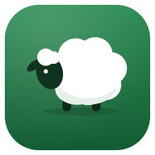

# Mi Explotación

**Una app móvil para llevar una pequeña explotación ganadera de ovejas y conejas.**
Censo, vacunas, partos, crías, pesos y cuentas, en el bolsillo y sin papeles.

[](https://nextjs.org)
[](https://react.dev)
[](https://tailwindcss.com)
[](https://orm.drizzle.team)
[](#-instalar-en-el-móvil)
[](LICENSE)

<br />

<picture>
  <source media="(prefers-color-scheme: dark)" srcset="docs/screenshots/hero-dark.png" />
  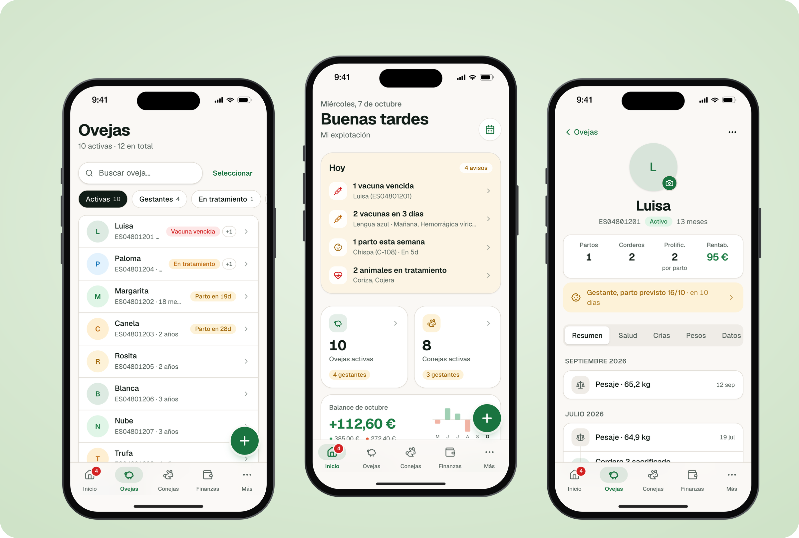
</picture>

</div>

---

## La historia

**Mi Explotación** nace para ayudar a mi padre a llevar su pequeña explotación
de ovejas y conejas: qué oveja se cubrió y cuándo, a quién le toca la vacuna,
cuántos corderos salieron o cuánto se gastó en pienso. Todo en una app que se
instala en el móvil y avisa cuando toca hacer algo.

Está pensada para usarse **de pie, en el corral y con una mano**: botones
grandes, pocos toques para registrar algo y nada de menús escondidos.

## ✨ Qué hace

<table>
<tr>
<td width="50%" valign="top">

### 🏠 Inicio que te dice qué hacer hoy
Saludo, avisos urgentes (vacunas vencidas, partos de la semana, animales en
tratamiento), censo de cada especie con las gestantes y balance del mes con
mini-gráfica.

### 🐑 Ovejas y 🐇 conejas
- Listados con buscador y **filtros rápidos**: gestantes, en tratamiento,
  vacuna vencida, candidatas a desvieje, bajas.
- **Ficha del animal** con foto (cámara del móvil), edad, madre e hijas,
  y KPIs: partos, crías, prolificidad y **rentabilidad**.
- **Línea de tiempo** con todo lo que le ha pasado: vacunas, enfermedades,
  cubriciones, partos, pesajes y gastos.
- **Vacunación en lote**: selecciona varias y regístralo de una vez.
- **Avisos de desvieje** según productividad y edad.

</td>
<td width="50%" valign="top">

### 🍼 Crianzas, corderos y camadas
- Fecha de parto prevista automática (días de gestación configurables).
- Semental, corderos (sexo, estado, venta, sacrificio) y camadas de conejos.
- **Las ventas pasan solas a Finanzas** como ingreso vinculado.
- **Genealogía**: una cordera puede "pasar al rebaño" como oveja nueva.
- **Pesajes** con curva de crecimiento.

### 💶 Finanzas
- Balance por mes o año y comparación con el periodo anterior.
- Gráfica de 12 meses que muestra los importes al tocarla, y desglose por categoría.
- Movimientos agrupados por día; **desliza para borrar** con *Deshacer*.
- Exportación a **CSV** lista para Excel.

</td>
</tr>
</table>

### 📅 Y además

- **Calendario** mensual y vista **Agenda** de los próximos 60 días.
- **Notificaciones push** con el resumen de la mañana (vacunas y partos).
- **Funciona sin cobertura**: muestra la última información guardada.
- **Modo oscuro** automático o manual.
- **Libro de explotación** imprimible y **copia de seguridad** completa en JSON.
- Botón **＋** siempre a mano para registrar cualquier cosa en dos toques.

## 📱 Capturas

<div align="center">

| Inicio | Ovejas | Ficha | Crianza |
|:---:|:---:|:---:|:---:|
| 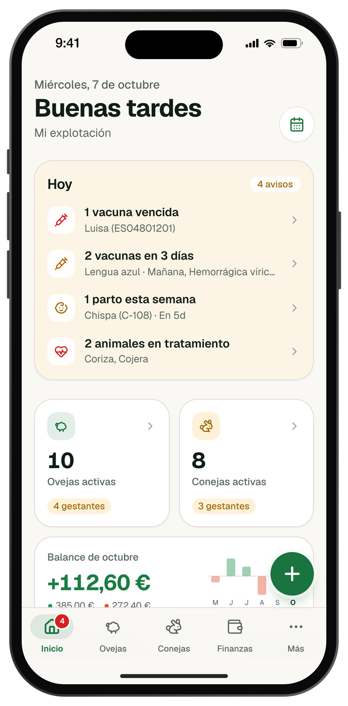 | 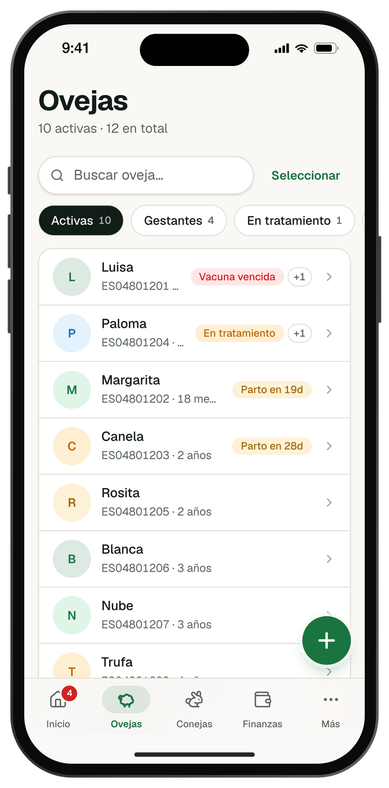 | 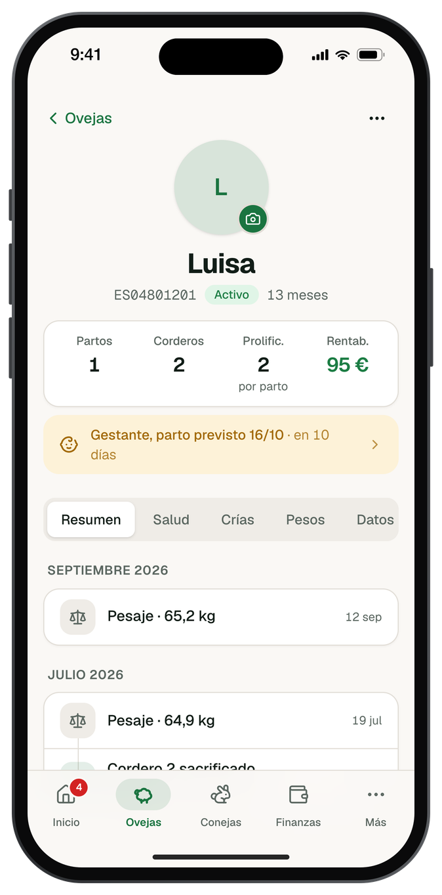 | 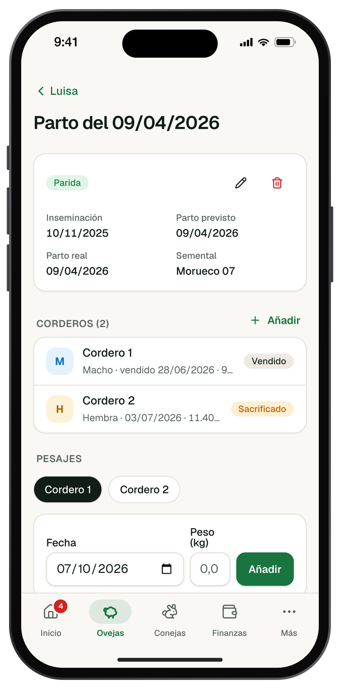 |

| Finanzas | Nuevo gasto | Calendario | Acciones rápidas |
|:---:|:---:|:---:|:---:|
| 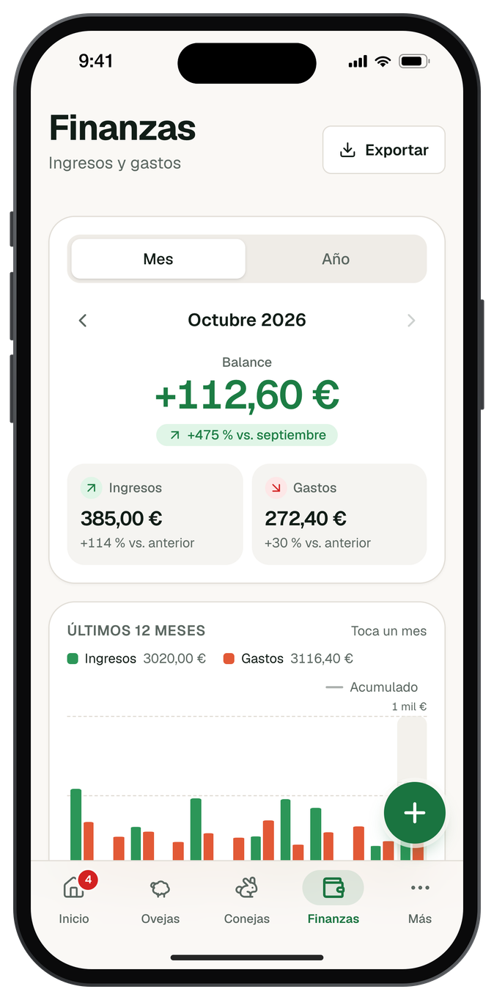 | 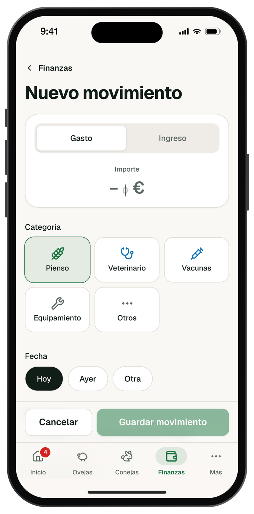 | 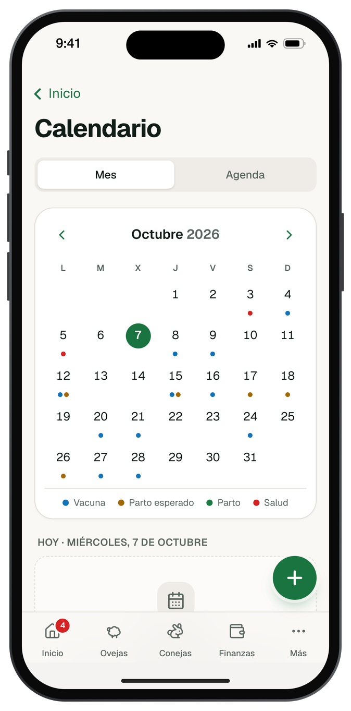 | 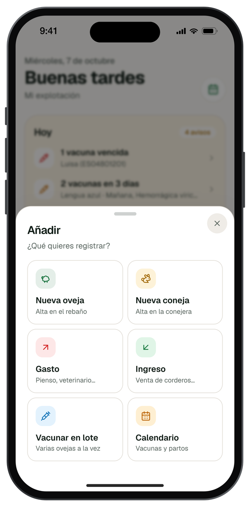 |

| Modo oscuro | | | |
|:---:|:---:|:---:|:---:|
| 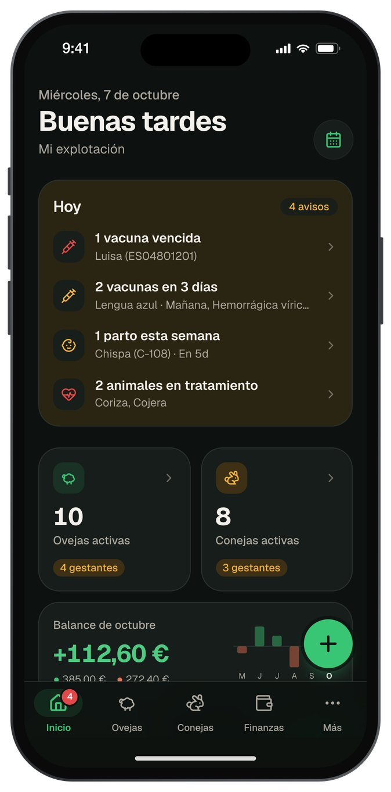 | 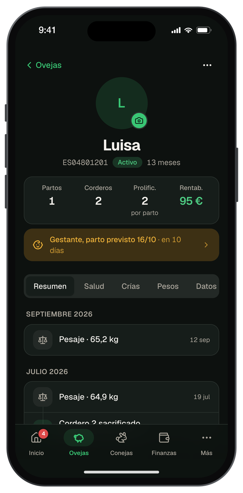 | 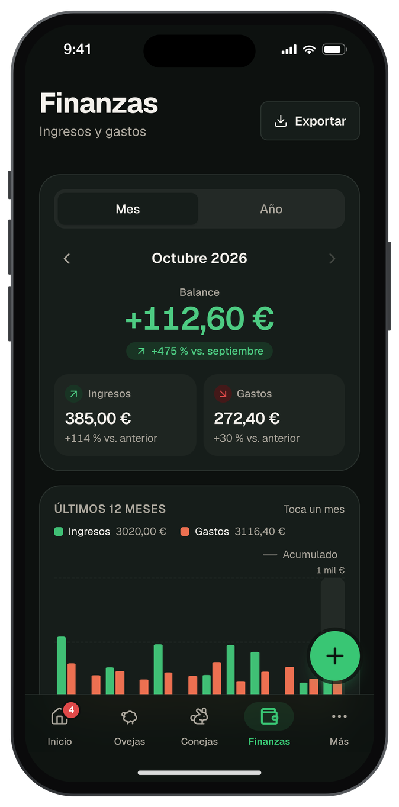 | 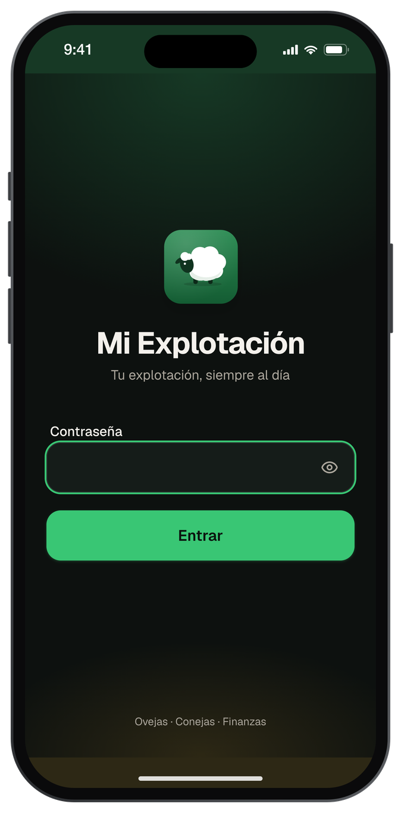 |

<sub>Capturas hechas con datos de demostración inventados.</sub>

</div>

## 🧱 Stack

| Capa | Tecnología |
|---|---|
| Framework | **Next.js 16** (App Router, Server Components, Server Actions, View Transitions) |
| UI | **React 19**, **Tailwind CSS v4**, Radix Primitives, [vaul](https://vaul.emilkowal.ski) (bottom sheets), [Sonner](https://sonner.emilkowal.ski) (toasts), Lucide |
| Datos | **PostgreSQL** + **Drizzle ORM**, validación con **Zod** |
| Demo local | **PGlite** (Postgres en WebAssembly, sin instalar nada) |
| PWA | Manifest + service worker propio (caché sin conexión, push), **Web Push** con VAPID |
| Auth | Contraseña única + cookie firmada con HMAC (Web Crypto), sin dependencias |
| Despliegue | **Vercel** + **Neon** (y Vercel Cron para el aviso diario) |

Todas las gráficas están hechas a mano con SVG, sin librerías de gráficos.

## 🚀 Pruébala en 1 minuto (sin base de datos)

Gracias a [PGlite](https://pglite.dev) puedes arrancarla con datos de demostración sin instalar Postgres:

```bash
git clone https://github.com/Ibonarambarri/MiExplotacion.git
cd MiExplotacion
pnpm install

cat > .env <<'EOF'
DATABASE_URL=pglite://./.data/demo
APP_PASSWORD=demo
SESSION_SECRET=cambia-esto-por-un-secreto-de-al-menos-32-caracteres
EOF

pnpm db:push     # crea las tablas
pnpm db:seed     # datos de demostración (inventados)
pnpm dev         # http://localhost:3000 · contraseña: demo
```

> Para verla en el móvil, abre `http://<IP-de-tu-ordenador>:3000` desde la misma wifi.

## 🛠️ Instalación con Postgres

Requisitos: **Node.js ≥ 20** y **pnpm ≥ 9**.

```bash
pnpm install
cp .env.example .env    # rellena DATABASE_URL, APP_PASSWORD y SESSION_SECRET
pnpm db:push            # base de datos nueva: crea todas las tablas
pnpm dev
```

### Variables de entorno

| Variable | Obligatoria | Descripción |
|---|:---:|---|
| `DATABASE_URL` | ✅ | Conexión Postgres (`postgresql://…`) o `pglite://<carpeta>` para el modo demo |
| `APP_PASSWORD` | ✅ | Contraseña de acceso a la app |
| `SESSION_SECRET` | ✅ | Secreto de ≥ 32 caracteres (`openssl rand -base64 48`) |
| `VAPID_PUBLIC_KEY` / `VAPID_PRIVATE_KEY` | — | Claves para notificaciones push (`npx web-push generate-vapid-keys`) |
| `NEXT_PUBLIC_VAPID_PUBLIC_KEY` | — | La misma clave pública, expuesta al navegador |
| `VAPID_SUBJECT` | — | Contacto `mailto:` del responsable |
| `CRON_SECRET` | — | Protege `/api/cron/reminders` (`openssl rand -base64 32`) |

Sin las variables opcionales la app funciona igual, solo que sin notificaciones.

### Actualizar una base de datos que ya tiene datos

Las mejoras de esquema se aplican con **migraciones SQL aditivas e idempotentes**
(`db/migrations/*.sql`): solo añaden columnas opcionales y tablas nuevas, nunca
borran ni modifican datos.

```bash
# 1. Copia de seguridad (recomendado siempre)
pg_dump "$DATABASE_URL" > copia-$(date +%F).sql

# 2. Aplicar migraciones
pnpm db:migrate
```

> `pnpm db:seed` se niega a ejecutarse si ya hay animales registrados, así
> que no puede mezclar datos de demostración con datos reales.

## ☁️ Despliegue en Vercel + Neon

1. Crea una base de datos gratuita en [Neon](https://neon.tech) y copia la cadena de conexión (*pooled*, `sslmode=require`).
2. Importa el repositorio en [Vercel](https://vercel.com/new) (detecta Next.js solo).
3. Añade las variables de entorno de la tabla anterior.
4. Crea las tablas una vez desde tu ordenador: `DATABASE_URL='postgresql://…' pnpm db:push`.
5. Despliega. El cron de `vercel.json` envía el resumen diario a las 8:00 (hora de España).

## 📲 Instalar en el móvil

- **iPhone (Safari):** Compartir → *Añadir a pantalla de inicio*. Ábrela desde el icono para activar las notificaciones.
- **Android (Chrome):** banner *Instalar app* o menú ⋮ → *Instalar aplicación*.

## 🗂️ Estructura

```
app/
  (auth)/login          Acceso
  (app)/                Rutas protegidas
    page.tsx            Inicio
    ovejas/ conejas/    Listados, fichas, crianzas, vacunación en lote
    finanzas/           Resumen, gráfica, movimientos, formulario
    calendario/         Mes y agenda
    mas/                Ajustes, libro de explotación
  api/                  Cron de avisos, exportación CSV y copia JSON
actions/                Server Actions (todas las escrituras)
components/
  ui/                   Primitivas (bottom sheet, listas, chips, segmentado…)
  animal/ finance/ nav/ pwa/ quick-actions/
db/
  schema.ts             Esquema Drizzle
  migrations/           Migraciones SQL aditivas (pnpm db:migrate)
  seed.ts               Datos de demostración
lib/
  queries/              Lecturas (indicadores, línea de tiempo, eventos…)
  dates.ts              Fechas en zona Europe/Madrid
  settings.ts           Ajustes de la explotación
public/                 Manifest, service worker e iconos
scripts/                Generación de iconos y marcos de capturas
```

## 🧪 Scripts

```bash
pnpm dev            # Desarrollo
pnpm build          # Build de producción
pnpm typecheck      # TypeScript
pnpm lint           # ESLint
pnpm db:push        # Crear/sincronizar tablas (base de datos nueva)
pnpm db:migrate     # Migraciones aditivas sobre una base existente
pnpm db:seed        # Datos de demostración
pnpm db:studio      # Drizzle Studio
pnpm icons          # Regenera los iconos de la app
pnpm screenshots    # Enmarca capturas de docs/screenshots/raw en un iPhone
```

## 🎨 Diseño

- Paleta de **cuaderno de campo**: verde campo, dorado cosecha y fondo crema; modo oscuro verde carbón.
- **Bottom sheets** que se cierran deslizando, en lugar de modales centrados.
- Pensada para el pulgar: zonas táctiles de ≥ 44 px, respuesta inmediata al pulsar, safe areas, sin zoom al escribir.
- Animaciones cortas que respetan *reducir movimiento*.

## 🤝 Contribuir

¡Las ideas y mejoras son bienvenidas! Abre un *issue* o un *pull request*.
Antes de enviar cambios:

```bash
pnpm typecheck && pnpm lint && pnpm build
```

## 📄 Licencia

[MIT](LICENSE) © 2026 Ibon Arambarri
